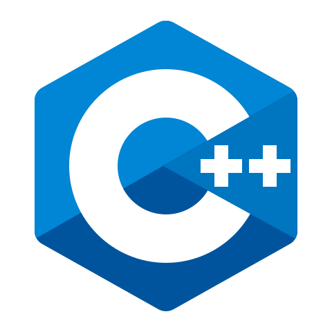
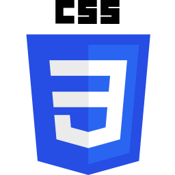

  
  

    
    
    
  

  
  <h1>
    Welcome!
  </h1>
  

     
  
  

  ### 🫔: About Me - Coding Wizard 
  
  🪤: Currently an AppDev Intern.

  :zap: In my free time, I work on personal projects and watch ThePrimeAgen and Theo.

  :mailbox: How to reach me: )
  ---
  
  

   <h1 align="center"> Languages | Frameworks | Tools </h1>
     

       
      <code></code>
      <code></code>
      <code></code>
      <code></code>
      <code></code>
      <code></code>
      <code></code>
      <code></code>
      <code></code>
      <code></code>
     

     

      <code></code>
      <code></code>
      <code></code>
      <code></code>
      <code></code>
      <code></code>
      <code></code>
      <code></code>
      <code></code>
    

  

  ---
  
  ### 🫀: Github View :
  

    
  

  

    
  

